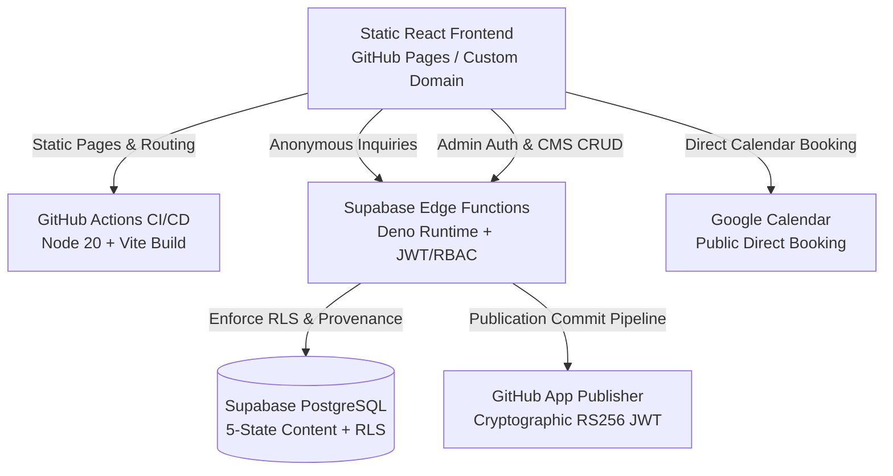

# Tanishk Singhal — Engineering Portfolio & Research Archive

[](https://github.com/Tanishk756/tanishksinghal.github.io/actions/workflows/deploy.yml)

- **Canonical Production URL**: **[https://tanishksinghal.in/](https://tanishksinghal.in/)**
- **Legacy GitHub Pages URL**: [https://tanishk756.github.io/tanishksinghal.github.io/](https://tanishk756.github.io/tanishksinghal.github.io/)

Engineering portfolio, autonomous robotics research repository, and content management platform for Tanishk Singhal. Specializing in ROS 2 node architecture, algorithmic path planning, closed-loop kinematics, embedded firmware, and UAV systems.

---

## 1. System Architecture Overview



### Core Technology Stack
- **Frontend Framework**: React 18 with TypeScript and Vite
- **Routing**: React Router v6 with project-base and root custom-domain compatibility
- **Styling**: Tailwind CSS + Vanilla CSS tokens under a curated *Light Editorial* visual system
- **Hosting & CI/CD**: GitHub Pages via GitHub Actions workflow
- **Backend & Database**: Supabase PostgreSQL with Row Level Security (RLS)
- **API Runtime**: Supabase Edge Functions (Deno TypeScript)
- **Direct Scheduling**: Google Calendar Appointment Integration

---

## 2. Public Route Catalog

| Route Path | Description | Access Control |
|:---|:---|:---|
| `/` | Hero, Featured Engineering, Research Overview | Public |
| `/about` | Biography, Research Philosophy & Academic Trajectory | Public |
| `/projects` | Engineering Systems, Autonomous Platforms, Hardware Projects | Public |
| `/projects/:slug` | Detailed Project Dossier | Public |
| `/experience` | Chronological Career & Engineering Timeline | Public |
| `/research` | Research Programs, Autonomous Kinematics, UAV Studies | Public |
| `/publications` | Peer-Reviewed Papers, Preprints & Technical Reports | Public |
| `/publications/:slug` | In-Depth Publication Dossier | Public |
| `/patents` | Intellectual Property & Patent Filings | Public |
| `/patents/:slug` | Patent Details | Public |
| `/achievements` | Honors, Awards, Hackathons & Fellowships | Public |
| `/certifications` | Verified Academic & Technical Credentials | Public |
| `/skills` | Matrix of Robotics Disciplines, Languages & Frameworks | Public |
| `/blog` | Technical Engineering Notebook & Articles | Public |
| `/blog/:slug` | Full Article Reading View | Public |
| `/resume` | Printable & Interactive Curriculum Vitae | Public |
| `/contact` | Direct Dispatch Inquiry Form + Direct Google Calendar Booking | Public |
| `/admin/*` | Authenticated CMS Content & Inquiries Management | Restricted (Admin Only) |

---

## 3. Contact & Direct Scheduling Architecture

The `/contact` route supports two independent interaction paths:
1. **Direct Communication Dispatch**: A structured contact form submitting to the `contact-submit` Supabase Edge Function with anti-spam honeypot, input sanitization, rate-limiting, and PostgreSQL storage protected by RLS.
   - **Transactional Email Dispatch**: Every legitimate inquiry triggers an asynchronous notification email to `tanishksinghal6285@gmail.com` via Resend (`RESEND_API_KEY` configured in Supabase Edge Secrets). If email dispatch encounters a provider issue, database storage remains the unaffected source of record and user submission succeeds gracefully.
2. **Direct Google Calendar Booking**: Direct scheduling via Google Calendar appointment schedule (`VITE_GOOGLE_BOOKING_URL`) opening in a secure new tab (`target="_blank" rel="noopener noreferrer"`). Requires no form submission, no OAuth, and no private API credentials.

---

## 4. Content Lifecycle & 5-State CMS Pipeline

All portfolio records follow a strict 5-state lifecycle and provenance gating model:

```
[ draft ]  -->  [ review ]  -->  [ approved ]  == (Publish Workflow) ==>  [ published ]
    │               │                │                                         │
    └───────────────┴────────────────┴─────────────────────────────────────────┴──> [ archived ]
```

### Provenance Gating
Only content with verified provenance (`USER_PROVIDED`, `GITHUB_VERIFIED`, `PUBLIC_WEB_VERIFIED`) can be approved and published. Content marked `PROBABLE` or `UNVERIFIED` is strictly quarantined.

### Publication Safety Contract
- Content CRUD (`admin-content`) cannot directly set `publication_status = 'published'`.
- Only `admin-publish` can perform publishing after validating admin authorization, approved lifecycle state, verified provenance, and cryptographic GitHub App commit verification.
- Public content feeds (`public-content`) only expose items with verified commit proofs.

---

## 5. Security & Authentication Model

- **Zero-Secret Client Model**: The client-side application only receives public variables prefixed with `VITE_`. Supabase service-role keys, GitHub App private keys, and database passwords exist solely within secure Supabase vault/environment variables.
- **Row-Level Security (RLS)**:
  - `contact_submissions`: Public can only INSERT; only authenticated admins can SELECT or UPDATE.
  - `content_items`: Public can only SELECT items with `publication_status = 'published'`; only authenticated admins can perform CRUD.
  - `audit_logs`, `publish_jobs`, `media_registry`: Strictly restricted to authenticated admins.
- **Admin Server-Side Verification**: Email whitelist enforcement and RS256 JWT validation on every admin endpoint.

---

## 6. Environment Variables

| Variable Name | Environment | Description |
|:---|:---|:---|
| `VITE_PUBLIC_SITE_URL` | Client / Public | Public canonical site URL (`https://tanishksinghal.in`) |
| `VITE_SUPABASE_URL` | Client / Public | Supabase project API gateway |
| `VITE_SUPABASE_ANON_KEY` | Client / Public | Browser-safe public anon key |
| `VITE_GOOGLE_BOOKING_URL` | Client / Public | Google Calendar public appointment schedule URL |
| `VITE_CMS_BACKEND` | Client / Public | CMS backend selector (`supabase` or `local`) |

*Private server secrets (`SUPABASE_SERVICE_ROLE_KEY`, `GITHUB_APP_ID`, `GITHUB_APP_PRIVATE_KEY_PEM`) are configured strictly on the Supabase Edge runtime.*

---

## 7. Local Development & Testing

```bash
# Install dependencies
npm ci

# Run test suite (206 security, architecture & resilient data-flow tests)
npm test

# Start development server
npm run dev

# Build production bundle
npm run build
```

---

## 8. CI/CD & Production Deployment

- **GitHub Actions Workflow**: `.github/workflows/deploy.yml` runs on every push to `main`.
- **Node.js**: Version 20 with cached dependencies.
- **Vite Build**: Injects public build variables and creates optimized static assets with code splitting.
- **Hosting**: Deployed directly to GitHub Pages with SPA fallback routing (`404.html`).
